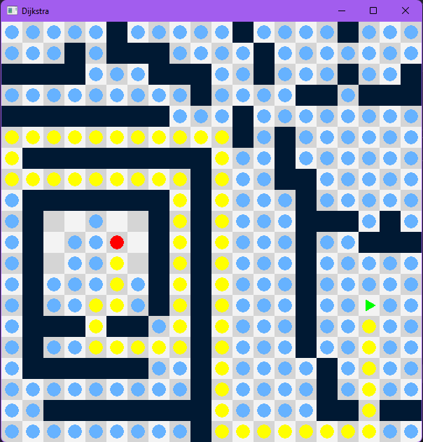

# Vijkstra
Dijkstra path finding algorithm implementation in V.

## Requirements

- [V](https://github.com/vlang/v)

## Usage
```shell
v run .
```

### Bindings
- Left click to add an obstacle
- Right click to reset the grid
- Enter to start/pause the algorithm

## Galery



## TODO

- [ ] Add possibility to change the start and end node by dragging them
  
- [ ] Implement A* and other path finding algorithms

- [ ] Implement maze generation algorithms (recursive backtracking, etc.)

- [ ] Add a menu to select the algorithm / maze generation algorithm

- [ ] Add possibility to change the grid size

